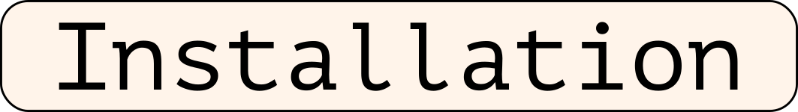

<div align="center">
  
</div>

<div align="center">

<h1>Labeling Neural Representations with Inverse Recognition</h1>
<h6>Accepted at 37th Conference on Neural Information Processing Systems (NeurIPS 2023)</h6>
<a href="https://arxiv.org/abs/2311.13594">Paper link</a>

[](https://colab.research.google.com/github/lapalap/invert/blob/main/hello_invert.ipynb)

<hr />
<br> 
</div>

<div align="center">

</div>
<br>

<div align="center">

</div>
<br>

<div align="center">
Inverse Recognition (INVERT) is a method designed to enhance our understanding of the representations learned by Deep Neural Networks (DNNs). It aims to bridge the gap between these complex, hierarchical data representations and human-understandable concepts. Unlike existing global explainability methods, INVERT is more scalable and less reliant on resources such as segmentation masks. It also offers an interpretable metric that measures the alignment between the representation and its explanation, providing a degree of statistical significance.
</div>

<br> 
<div align="center">

</div>
<br> 

You can it via pip as shown below:
```
! git clone https://github.com/lapalap/invert.git --quiet
! pip install git+file:///content/invert --quiet
```
<br> 
<div align="center">

</div>
<br> 

You can get started with the following [colab notebook](https://colab.research.google.com/github/lapalap/invert/blob/main/hello_invert.ipynb).

<br> 
<div align="center">

</div>
<br> 

```bibtex
@article{bykov2023labeling,
  title={Labeling Neural Representations with Inverse Recognition},
  author={Bykov, Kirill and Kopf, Laura and Nakajima, Shinichi and Kloft, Marius and H{\"o}hne, Marina M-C},
  journal={arXiv preprint arXiv:2311.13594},
  year={2023}
}
```
