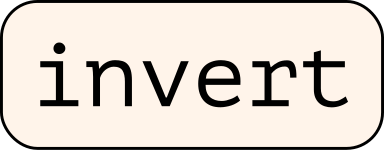

<div align="center">
  
</div>

<div align="center"><h1>Labeling Neural Representations with Inverse Recognition</h1>
<h5>The toolkit to explore the Representation Spaces of Deep Neural Networks</h5>
<h6>PyTorch version</h6>
<h5 href="https://arxiv.org/abs/2311.13594">Paper link</h5></div>
<div align="center">

[](https://colab.research.google.com/github/lapalap/dora/blob/dev/examples/hello_dora.ipynb)
</div>

<div align="left">

</div>
<hr />

Data-agnOstic Representation analysis – *DORA* – is the automatic framework for inspecting the representation space of Deep Neural Networks for infected neurons (i.e. neurons that are representing spurious or artifactual concepts).
Independent of data, for any given DL model DORA, allows to automatically detect anomalous representations, that bear a high risk of learning unintended spurious concepts deviating from the desired decision-making policy.
Infected representations, found by DORA, can also be used as artifact detectors when applied to any given dataset – allowing furthermore an automatic detection and successive cleaning of infected data points.

<div align="center">

</div>

With DORA user can investigate networks for presence of artifactual representations. As an example, DORA was able to found cluster of unintended (spurious) Chinese-character detector in representations from standard ImageNet trained networks.

<div align="center">

</div>

<div align="left">

</div>
<hr />

You can it via pip as shown below:
```
pip install git+https://github.com/lapalap/dora.git
```

<div align="left">

</div>
<hr />

You can get started either with the [colab notebook](https://colab.research.google.com/github/lapalap/dora/blob/dev/examples/hello_dora.ipynb) or locally as shown below:

Let's start by analysing some neurons from the pre-trained resnet18:

```python
import torch
import torchvision.models as models
import torchvision.transforms as transforms

device = torch.device("cuda" if torch.cuda.is_available() else "cpu")
neuron_indices = [i for i in range(100, 200)]

model = models.resnet18(pretrained=True).eval().to(device)
my_transforms = transforms.Compose(
    [
        transforms.ToTensor(),
        transforms.Normalize(mean=[0.485, 0.456, 0.406], std=[0.229, 0.224, 0.225]),
    ]
)
```

And then use dora to generate synthetic activation maximization signals and collect their encodings on the same layer :sparkles:

```python
from dora import Dora
from dora.objectives import ChannelObjective

d = Dora(model=model, image_transforms=my_transforms, device=device)

d.generate_signals(
    neuron_idx=neuron_indices,
    layer=model.avgpool,
    objective_fn=ChannelObjective(),
    lr=18e-3,
    width=224,
    height=224,
    iters=90,
    experiment_name="model.avgpool",
    overwrite_experiment=True,  ## will still use what already exists if generation params are same
)
```


<div align="left">

</div>
<hr />

```bibtex
@article{bykov2023labeling,
  title={Labeling Neural Representations with Inverse Recognition},
  author={Bykov, Kirill and Kopf, Laura and Nakajima, Shinichi and Kloft, Marius and H{\"o}hne, Marina M-C},
  journal={arXiv preprint arXiv:2311.13594},
  year={2023}
}
```
