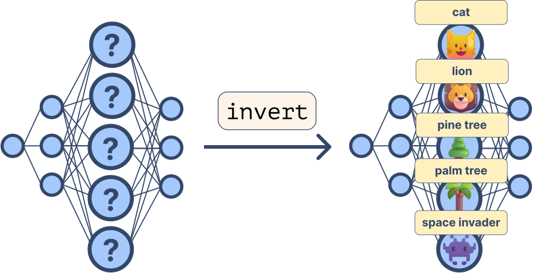

<div align="center">
  
</div>

<div align="center"><h1>Labeling Neural Representations with Inverse Recognition</h1>
<h5>The toolkit to connect neurons with human-understandable concepts</h5>
<h6>Accepted at 37th Conference on Neural Information Processing Systems (NeurIPS 2023)</h6>
<h5 href="https://arxiv.org/abs/2311.13594">Paper link</h5></div>
<div align="center">

[](https://colab.research.google.com/github/lapalap/invert/blob/main/hello_invert.ipynb)
</div>

<div align="left">

</div>
<hr />

<div align="center">
Inverse Recognition (INVERT) is a method designed to enhance our understanding of the representations learned by Deep Neural Networks (DNNs). It aims to bridge the gap between these complex, hierarchical data representations and human-understandable concepts. Unlike existing global explainability methods, INVERT is more scalable and less reliant on resources such as segmentation masks. It also offers an interpretable metric that measures the alignment between the representation and its explanation, providing a degree of statistical significance.
</div>

<div align="center">

</div>

With DORA user can investigate networks for presence of artifactual representations. As an example, DORA was able to found cluster of unintended (spurious) Chinese-character detector in representations from standard ImageNet trained networks.

<div align="center">

</div>

<div align="left">

</div>
<hr />

You can it via pip as shown below:
```
pip install git+https://github.com/lapalap/dora.git
```

<div align="left">

</div>
<hr />

You can get started either with the [colab notebook](https://colab.research.google.com/github/lapalap/dora/blob/dev/examples/hello_dora.ipynb) or locally as shown below:

Let's start by analysing some neurons from the pre-trained resnet18:

```python
import torch
import torchvision.models as models
import torchvision.transforms as transforms

device = torch.device("cuda" if torch.cuda.is_available() else "cpu")
neuron_indices = [i for i in range(100, 200)]

model = models.resnet18(pretrained=True).eval().to(device)
my_transforms = transforms.Compose(
    [
        transforms.ToTensor(),
        transforms.Normalize(mean=[0.485, 0.456, 0.406], std=[0.229, 0.224, 0.225]),
    ]
)
```

And then use dora to generate synthetic activation maximization signals and collect their encodings on the same layer :sparkles:

```python
from dora import Dora
from dora.objectives import ChannelObjective

d = Dora(model=model, image_transforms=my_transforms, device=device)

d.generate_signals(
    neuron_idx=neuron_indices,
    layer=model.avgpool,
    objective_fn=ChannelObjective(),
    lr=18e-3,
    width=224,
    height=224,
    iters=90,
    experiment_name="model.avgpool",
    overwrite_experiment=True,  ## will still use what already exists if generation params are same
)
```


<div align="left">

</div>
<hr />

```bibtex
@article{bykov2023labeling,
  title={Labeling Neural Representations with Inverse Recognition},
  author={Bykov, Kirill and Kopf, Laura and Nakajima, Shinichi and Kloft, Marius and H{\"o}hne, Marina M-C},
  journal={arXiv preprint arXiv:2311.13594},
  year={2023}
}
```
